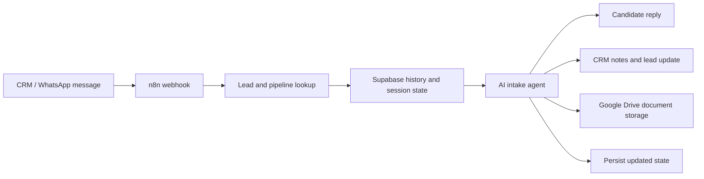

<p align="center">
  
</p>

# AI Recruitment Automation

A production n8n workflow for Azumi Staff for managing multilingual candidate conversations across a CRM of your choice. It combines AI-assisted intake, persistent conversation state, document processing, and CRM updates into one operational workflow.

## What it does

The workflow helps a recruitment team respond consistently at scale while preserving the context needed for a human handoff. It can:

- Route conversations by CRM pipeline and language
- Maintain candidate history and structured session state in Supabase
- Process CVs, images, voice messages, videos, and uploaded documents
- Generate concise candidate replies and manager-facing CRM notes
- Track requested and received documents
- Qualify leads only after the required information is collected
- Store processed candidate files in Google Drive

## Architecture



## Workflow design

### Conversation routing

The workflow reads the lead's CRM pipeline, then adds the relevant country context to the AI prompt. Language is fixed from the candidate's first message, so later documents in another language do not change the reply language.

### Persistent state

Supabase stores both the chronological chat history and the latest structured candidate state, such as language, current step, location, vacancy interest, and received documents. This lets the workflow continue a conversation without repeating completed questions.

### Candidate documents

Specialized branches process CVs and other attachments. The workflow can extract and translate CV content, retain only the information needed for recruitment, and store processed artifacts in a candidate-specific Google Drive folder using a model of your choice. 

### Human-friendly CRM records

Each interaction can update two CRM notes:

- **Main note**: a complete, structured candidate record
- **Summary note**: short manager-facing conclusions for quick review

## Technology

- [n8n](https://n8n.io/) for orchestration
- AmoCRM-compatible APIs for lead and chat operations
- Supabase for conversation history and state
- Google Drive for document storage
- LLM providers for language-aware intake and document analysis

## Getting started

1. Import [`workflow.template.json`](workflow.template.json) into a non-production n8n instance.
2. Create your own n8n credentials for the CRM, Supabase, Google Drive, and chosen LLM provider.
3. Replace every `YOUR_*` placeholder with values from your own environment.
4. Configure the incoming CRM chat channel to create leads in the appropriate pipeline before the workflow runs.
5. Create the required Supabase tables for chat history and session state.
6. Test with synthetic leads and documents before enabling the workflow for real candidates.

## Repository structure

```text
.
├── workflow.template.json       # Sanitized, inactive n8n workflow
├── scripts/
│   └── sanitize-workflow.mjs    # Removes environment-specific values from an export
├── .env.example                 # Placeholder configuration names
└── README.md
```

## Hosting

Recommended to run on a dedicated Linux server. 
